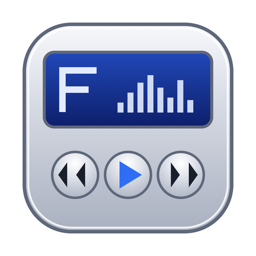
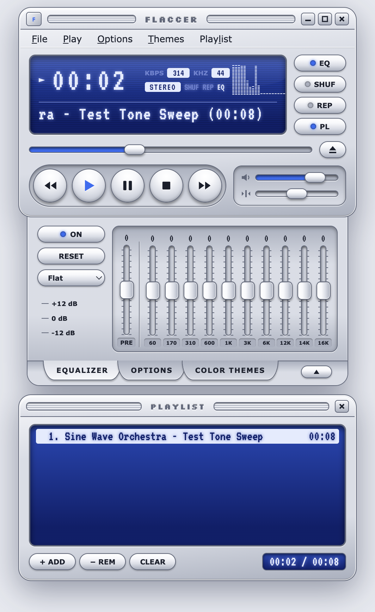
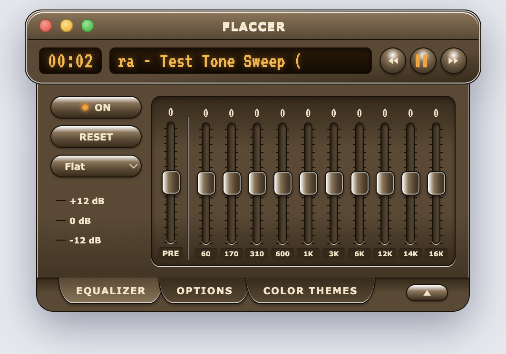
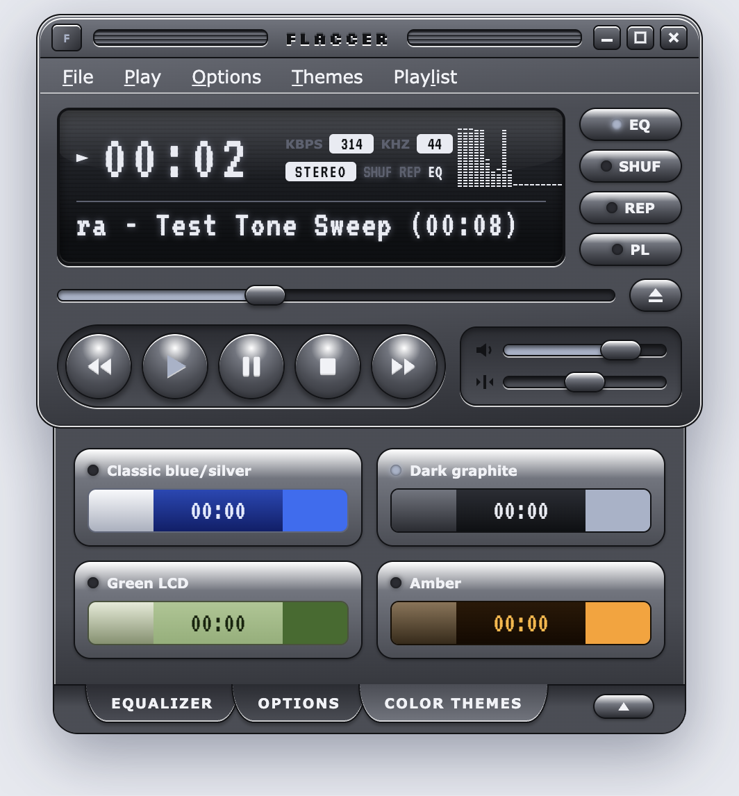
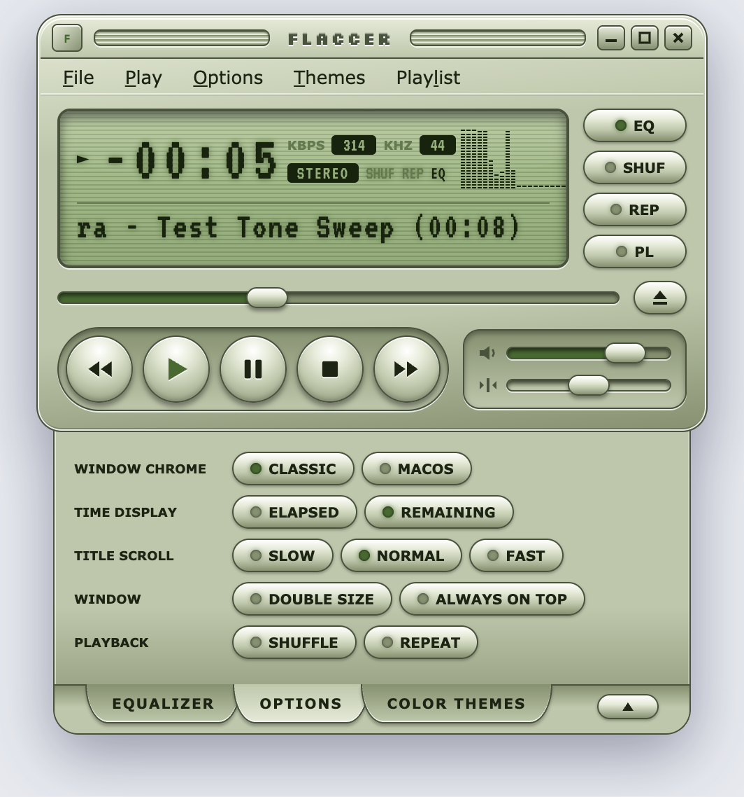

<p align="center">
  
</p>

<h1 align="center">FLACCER</h1>

<p align="center">
  A Winamp-style FLAC player for macOS. Skeuomorphic chrome, glowing LCD, 10-band EQ, four colour themes.
</p>

<p align="center">
  <a href="https://github.com/angad-kandhari/flaccer/releases/latest"></a>
  
  
  <a href="LICENSE"></a>
</p>

<p align="center">
  
</p>

## Install

1. Download `FLACCER-x.y.z.dmg` from the [latest release](https://github.com/angad-kandhari/flaccer/releases/latest).
2. Open it and drag **FLACCER** into **Applications**.
3. First launch: right-click the app and choose **Open** (the build is not notarized).

Then drop FLAC files or folders onto the player, press **⌘O**, or hit **+ ADD** in the playlist.

## Features

- **Lossless playback** of FLAC, plus MP3, AAC/M4A, OGG/Opus, WAV and AIFF.
- **Real metadata on the LCD**: title, artist, sample rate and bitrate read straight from the FLAC stream.
- **10-band equalizer** with preamp, presets (Rock, Pop, Jazz, Classical, Bass Boost, Vocal) and per-band reset.
- **Spectrum analyser / oscilloscope** on the display, click to switch.
- **Playlist** with shuffle, repeat, folder import, relinking of moved files, and totals.
- **Four themes**: Classic blue/silver, Dark graphite, Green LCD, Amber. Classic or macOS window chrome.
- **Compact (windowshade) mode**, double-size mode, always-on-top.
- **macOS integration**: media keys and the Now Playing widget, Open With from Finder, drag and drop, native dialogs.
- Settings and playlist persist between launches. Works fully offline.

## Themes

| Amber, compact mode, macOS chrome | Dark graphite, theme picker | Green LCD, options |
| :---: | :---: | :---: |
|  |  |  |

## Keyboard

| Action | Keys |
| --- | --- |
| Play / pause | `Space` or `⌘P` |
| Previous / next track | `←` / `→` or `⌘←` / `⌘→` |
| Stop | `⌘.` |
| Open files / folder | `⌘O` / `⇧⌘O` |
| Volume | `⌘↑` / `⌘↓` |
| Shuffle / repeat | `⇧⌘S` / `⇧⌘R` |
| Compact mode / double size | `⇧⌘M` / `⌘D` |
| Equalizer / playlist panel | `⌘E` / `⌘L` |
| Always on top | `⌘T` |

## Build from source

```sh
git clone https://github.com/angad-kandhari/flaccer.git
cd flaccer
npm install
npm start                 # run the player
npm run pack              # dist/FLACCER-darwin-arm64/FLACCER.app
npm run dmg               # dist/FLACCER-<version>.dmg (drag-to-Applications image)
```

Pushing a `v*` tag builds the DMG on GitHub Actions and attaches it to a release.

## How it's built

The UI was designed in [Claude Design](https://claude.ai/design) and is rendered exactly as exported. The app wraps it in an Electron shell.

| Path | Purpose |
| --- | --- |
| `FLACCER v2.dc.html` | The design export, the source of truth for the UI |
| `renderer/template.html` | `<x-dc>` markup extracted from the design (`npm run sync-design`) |
| `renderer/dc-runtime.js` | Compiles the design's template dialect (`{{ }}`, `sc-if`, `sc-for`, `style-hover`) to React |
| `renderer/player.js` | Player logic ported from the design script, wired to the shell |
| `src/main.js` | Frameless transparent window, `flaccer://` media protocol, dialogs, menu, folder scanning |
| `src/flac-meta.js` | Dependency-free FLAC STREAMINFO and Vorbis comment reader |
| `src/preload.js` | Context bridge between the renderer and main process |
| `scripts/make-dmg.sh` | Builds the installer image with `hdiutil` and lays out the Finder window |

Audio runs through Web Audio: media element → preamp → 10 biquad filters → analyser → stereo panner → gain. The page and the media it plays share one custom origin so the analyser and EQ are allowed to touch the decoded samples.

### Updating the UI from the design

1. Replace `FLACCER v2.dc.html` with the new export.
2. `npm run sync-design` regenerates `renderer/template.html` and `renderer/design-logic.reference.js`.
3. Diff the reference script against `renderer/player.js` and port any logic changes.

### Debug flags

`--debug` opens DevTools · `--user-data <dir>` uses a separate profile · `--state '{"theme":"amber"}'` seeds UI state · `--screenshot out.png` captures the window and quits.

## License

[MIT](LICENSE). Inspired by the classic Winamp 2 skin; not affiliated with Winamp or Nullsoft.
